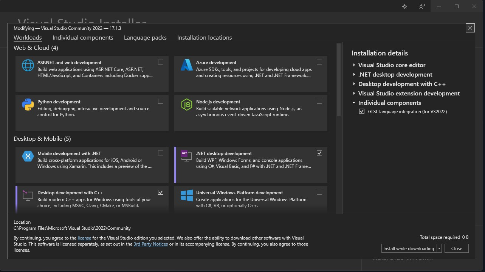
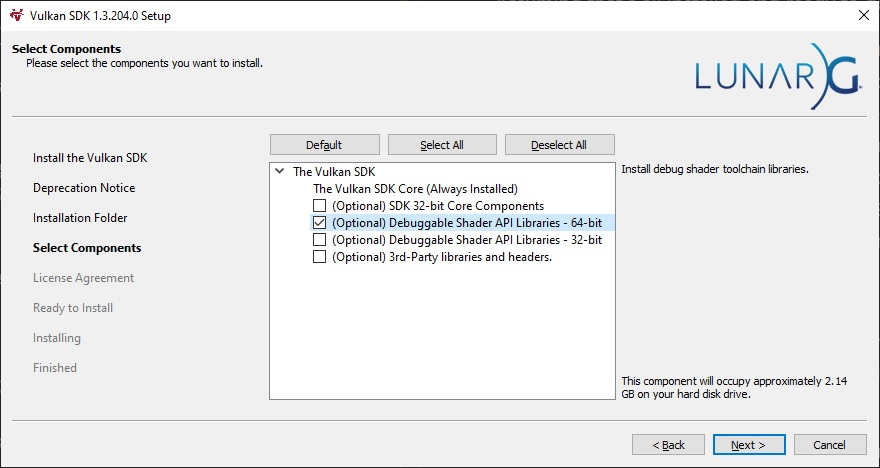

# Ant

Ant is a self learn game engine, code base on Hazel Engine(<https://github.com/TheCherno/Hazel>)

 ---

## Getting   Started

### Requirements

One of our goals is to make Ant as easy as possible to build - if you're having any difficulties or weird errors, please let us know. We currently only support building on Windows 10 and Windows 11 with Visual Studio 2022, Visual Studio 2019 is no longer supported. The minimum supported version of Visual Studio 2022 is 17.2.0, Ant may not compile on versions before that. You also need the following installed:

- [Git](https://git-scm.com/downloads)
- [Git-LFS](https://git-lfs.com/)
- [Python 3](https://www.python.org/downloads/)
- [.NET Framework 4.7.2](#.NET)
- [Vulkan](#Vulkan)
Make sure that you add everything except for the .NET Framework SDK to your PATH environment variable. Most likely the installers will give you the option to so automatically.

### Building and Running

Assuming that's all installed and ready to go, you can proceed with the following:

1. Clone the repository with `git clone --recursive https://github.com/Ant-Play/Ant.git`.
2. Add an environment variable called `ANT_DIR` that contains the file path to the root Ant folder (e.g `C:/Dev/Ant`)
3. Run `Scripts/Setup.bat` - this will download required libraries and make sure everything is setup correctly(this need you have python on your computer)
4. Open `Ant.sln` and build either `Debug` or `Release` `x64` - AntPlay should be the startup project so really you can just hit `F5` to build and debug the startup project. By default, this will load the Sandbox project found in `AntPlay/SandboxProject/Sandbox.aproj`
5. Open `AntPlay/SandboxProject/Sandbox.sln` and build in either `Debug`or `Release`. This will build the C# module of the Sandbox project which is necessary to properly play the various scenes in the project.

### 
.NET Framework

Ant makes use of C# as a scripting language, and because of that we also provide a "Ant-ScriptCore" project, which contains Ants C# API. This however means that in order to build Ant you need to have the .NET Framework SDK installed. Ant makes use of .NET Framework 4.7.2, and all projects that are made in Ant also use that specific version.

If you're using Visual Studio to build Ant you'll have to open the Visual Studio Installer program, and make sure you've selected the ".NET desktop development" workload from the "Workloads" tab, you can find an example of this in the image below.

You may be required to restart your computer after installing the workload.

### 
Vulkan

Ant requires Vulkan SDK 1.3.204.1 to be installed, and the `VULKAN_SDK`environment variable set to your installation path. If you do not have the correct version installed, the Setup script should offer to download and install the correct version for you.

The Vulkan SDK installer now offers to download and install shader debug libraries - you must install these libraries if you would like to build Ant in the Debug configuration. To do so, simply check the `(Optional) Debuggable Shader API Libraries - 64 bit` option in the `Select Components` part of the installer, as seen in the image below.

You can also [download and install the Vulkan SDK manually](https://sdk.lunarg.com/sdk/download/1.3.204.1/windows/VulkanSDK-1.3.204.1-Installer.exe) if you wish, or if the Setup scripts have failed.

### Pulling the latest code

The `master` branch is required to always be stable, so there should never be any build errors or major faults. Once you've pulled the latest code, remember to run `Scripts/Setup.bat` again to make sure that any new files or configuration changes will be applied to your local environment.

### Supported Platforms

Here you can find a list of the platforms that Ant currently supports.

If you can't find the platform you're looking for on this page you should assume that Ant does not currently, and most likely never will, support that platform.

#### Fully Supported

These are the platforms that Abt has been tested on, and we've determined that Ant should run without any serious problems.
If you find an issue relating to any of these platforms please open an issue here:
<https://github.com/Ant-Play/Ant/issues>

- Windows 10 (64-bit)
- Windows 11 (64-bit)

NOTE: Ant currently only considers 64-bit Windows versions supported, and it's unlikely that 32-bit support will ever be added

#### Unsupported Platforms

These are platforms that Ant most likely won't work on.

- Windows 7
- MacOS
- Linux Based Platforms (May eventually be supported)

#### Supported Editors + Toolchains

Ant will in theory support any IDE or toolchain that <https://premake.github.io/docs/Using-Premake#using-premake-to-generate-project-files> supports, however we've only tested the toolchains/IDEs listed below.

- Visual Studio 2022
- CodeLite

## Demo    Show

### Main   Window

### Hard   Shadow

### Sofe Shadow

### PBR

### Scripts And Physx
